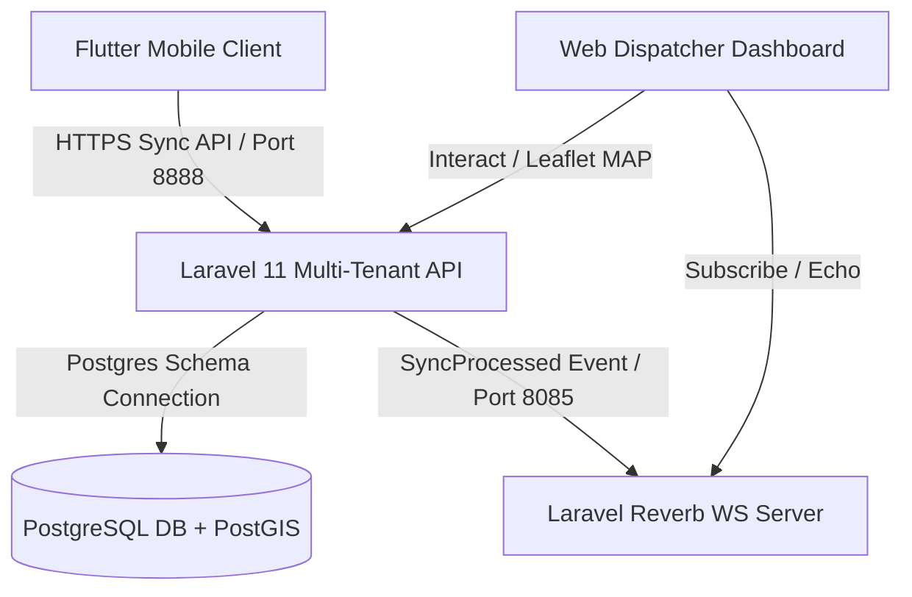
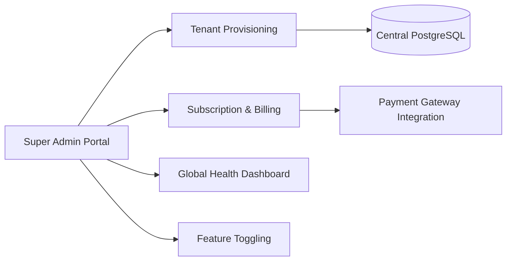
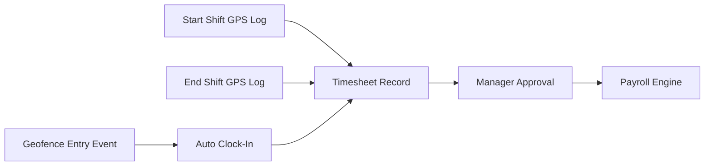
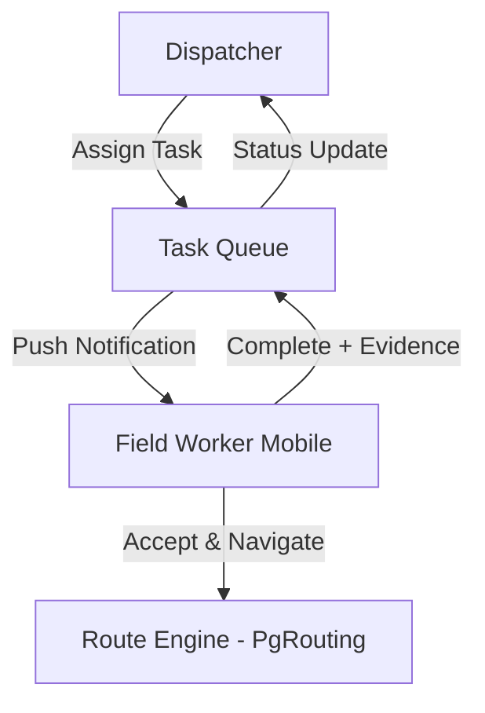

# OmniRoute: System Architecture & Technical Specifications

OmniRoute is a production-grade, multi-tenant Field Force Automation SaaS. It combines offline-first mobile tracking operations with a real-time dispatcher telemetry portal.

---

## 1. Architectural Blueprint

The system employs a decoupled, multi-tenant architecture designed to isolate client data securely while offering sub-second location updates from background mobile isolates.



---

## 2. Infrastructure Specifications

### Multi-Tenancy (Schema Isolation)
* We utilize `stancl/tenancy` with the **PostgreSQL Schema Isolation Driver**. 
* Each tenant (e.g., `acme`, `test`) resides in its own database schema namespace (e.g., `tenantacme`, `tenanttest`).
* **PostGIS Search Path Resolution:** Since spatial functions reside in the `public` schema, switching connection contexts hides the geography types. We handle this dynamically in [TenancyServiceProvider.php](file:///d:/Dev/omniroute-v2/app/Providers/TenancyServiceProvider.php) by executing:
  ```php
  DB::statement("SET search_path TO {$tenant->getTenantKey()}, public");
  DB::purge('tenant'); // Force connection boot with new search path
  ```

### Database & Spatial Engine
* **Engine:** PostgreSQL + PostGIS (`postgis/postgis:15-3.3`).
* **Spatial Columns:** All coordinates are stored utilizing the PostGIS Point type using the native 4326 Spatial Reference System (SRS).
* Central migrations reside in `database/migrations/` (tenants, domains, users). Tenant-specific migrations reside in `database/migrations/tenant/` (outlets, tracking logs, geofences).

### Real-Time Communications (WebSockets)
* **Server:** Laravel Reverb (running on port `8085` to avoid conflicts with existing processes on port `8080`).
* **Event Loop:** `SyncProcessed` and `GeofenceAlertTriggered` events are broadcasted over the tenant's private channels (`tenant.{tenant_id}.sync`).
* **Fault Tolerance:** Dispatch handshakes are wrapped in `try-catch` blocks inside services/jobs so that if the WebSocket socket server is offline, HTTP push synchronization requests still succeed and return `200 OK`.

---

## 3. Data Synchronization Engine (LWW)

Synchronization relies on a bidirectional Last-Write-Wins (LWW) replication engine.

```
       [ MOBILE Isar DB ]                          [ Laravel Server ]
               |                                           |
               |---- 1. pushUnsyncedLogs (Chunk: 50) ----->|
               |                                           | (LWW Version Check)
               |<--- 2. response 200 OK (Success Count) ---|
               | (Mark local logs as synced)               |
               |                                           |
               |---- 3. pullSync (Token + timestamp) ----->|
               |                                           | (Fetch updated definitions)
               |<--- 4. response 200 (Outlets/Logs) -------|
               | (Save local schemas)                      |
```

### Batch Chunking Constraint
To prevent payload timeouts on high-latency mobile networks, the mobile `SyncRepository` slices unsynced location logs into batches of **50 logs per HTTP request** during the push phase.

---

## 4. Mobile Client Specifications

* **Platform Framework:** Flutter SDK (`>=3.4.3 <4.0.0`).
* **Local Database:** Isar NoSQL (Fully reactive, bridge-free local database).
* **Background Execution:** `flutter_background_service` running in a dedicated Android foreground notification isolate to avoid OS termination under energy restrictions.
* **MinSdkVersion:** Configured to `23` (Android 6.0+) in [build.gradle](file:///d:/Dev/omniroute-v2/mobile/android/app/build.gradle#L46) to support secure cryptographic modules.
* **Session Persistence:** `flutter_secure_storage` to encrypt tokens, tenant domains, and worker profile metrics in the native Android Keystore and iOS Keychain.

---

## 5. Enterprise SaaS Module Roadmap

The following sections define the full product scope required to achieve feature parity with enterprise platforms like **Efisales** (field sales management) and **Trackolap** (real-time employee tracking & dispatch).

### Module Completion Status

| Module | Status | Est. % |
|--------|--------|--------|
| Core Tracking & Sync Engine | ✅ Complete | 100% |
| Multi-Tenant Schema Isolation | ✅ Complete | 100% |
| Real-Time WebSocket Mapping | ✅ Complete | 100% |
| Secure Mobile Auth & Session | ✅ Complete | 100% |
| Central SaaS Super-Admin Layer | 🔲 Not Started | 0% |
| Sales Operations & Order Management | 🔲 Not Started | 0% |
| HR & Attendance Management | 🔲 Not Started | 0% |
| Payroll Processing Engine | 🔲 Not Started | 0% |
| Expense & Asset Management | 🔲 Not Started | 0% |
| CRM & Task Dispatching | 🔲 Not Started | 0% |
| Geofence Controls & Dispatch Routing | 🔲 Not Started | 0% |
| Analytics & Performance Reporting | 🔲 Not Started | 0% |

**Overall Platform Completion: ~25%** (core engine operational; business logic layers pending)

---

### 5.1 Central SaaS Super-Admin Layer

This is the platform owner's control plane, operating outside of any tenant context on the central database.



#### 5.1.1 Tenant Provisioning & Onboarding
* Automated creation of tenant database schemas, subdomain DNS records, and initial admin credentials when a new company signs up.
* Self-service registration flow with email verification.
* Tenant lifecycle management (suspend, archive, delete).

#### 5.1.2 Subscription & Billing Engine
* SaaS tier definitions (e.g., **Basic**, **Pro**, **Enterprise**) stored in the central database.
* Usage metering: enforce limits on user counts, storage quotas, and API rate limits per tier.
* Payment gateway integration (Stripe, M-Pesa, PayPal) for recurring invoicing.
* Dunning management: automated emails for failed payments and grace period enforcement.

#### 5.1.3 Global System Health & Analytics
* Centralized dashboard for the platform owner to monitor:
  * Active tenant count and per-tenant user activity.
  * Sync queue depth and failure rates.
  * Database schema sizes and storage consumption.
  * Server load, WebSocket connection counts, and API latency percentiles.

#### 5.1.4 Feature Toggling
* Dynamically enable/disable modules (e.g., Payroll, Advanced CRM, Geofence Routing) per tenant based on subscription tier.
* Feature flags stored in the central `tenants` table metadata, evaluated at middleware level.

---

### 5.2 Sales Operations & Order Management

#### Mobile (Flutter)
* Local Isar collections for `Products`, `Inventory`, `Invoices`, and `SalesOrders`.
* Offline order capture forms with barcode/QR scanning support.
* Photo evidence attachments for proof-of-delivery.

#### Web (Laravel/Vue)
* Product catalogue management with pricing tiers per tenant.
* Order lifecycle tracking (Created → Confirmed → Dispatched → Delivered).
* Inventory stock level alerts and replenishment workflows.

#### Sync
* Expand the LWW sync repository to push transactions/orders and pull product catalogue definitions bidirectionally.

---

### 5.3 HR & Attendance Management



#### 5.3.1 Timesheet Generation
* Convert raw "Start Shift" / "End Shift" timestamps and GPS logs into formal, auditable timesheet records.
* Manager approval workflow: Pending → Approved → Rejected (with rejection notes).
* Overtime calculation rules configurable per tenant.

#### 5.3.2 Geofence-Based Attendance
* Automatically clock a user **in** when they enter a designated warehouse/office geofence polygon.
* Automatically clock a user **out** when they exit the geofence for a sustained period.
* Late arrival and early departure flagging.

#### 5.3.3 Leave & Absence Management
* Leave request submission from mobile (annual, sick, compassionate).
* Manager approval/rejection workflow on the web dashboard.
* Leave balance tracking and accrual rules per tenant policy.
* Calendar view of team availability for dispatch planning.

---

### 5.4 Payroll Processing Engine

#### 5.4.1 Wage Calculation
* Link approved timesheets to wage calculations (hourly, daily, or monthly rates).
* Support for multiple pay schedules (weekly, bi-weekly, monthly).

#### 5.4.2 Commissions & Deductions
* Commission rules tied to Sales Operations (e.g., % of order value, tiered targets).
* Tax deduction templates (PAYE, NHIF, NSSF for Kenya; extensible per jurisdiction).
* Statutory and voluntary deduction management.

#### 5.4.3 Payslip Generation
* Digital payslip PDF generation with itemized breakdowns.
* Mobile push notification when payslip is available.
* Historical payslip archive accessible from both web and mobile.

---

### 5.5 Expense & Asset Management

#### 5.5.1 Expense Claims
* **Mobile:** Offline receipt photo capture (fuel, travel, meals) with amount, category, and notes.
* **Sync:** Push expense claims with Base64-encoded receipt images during next sync cycle.
* **Web:** Finance team approval workflow (Submitted → Under Review → Approved → Reimbursed).
* Integration with Payroll Engine for reimbursement disbursement.

#### 5.5.2 Asset Tracking
* Track company equipment assigned to field workers: vehicles, tablets, product samples, uniforms.
* Asset lifecycle management: Issued → In Use → Returned → Decommissioned.
* GPS-tagged asset location (for vehicles with OBD-II trackers).
* Depreciation tracking and maintenance schedule alerts.

---

### 5.6 CRM & Task Dispatching

#### 5.6.1 Customer Relationship Management
* Expand the existing `Outlets` model into a full CRM entity with:
  * Contact persons (name, phone, email, role).
  * Interaction history log (visits, calls, emails, complaints).
  * Scheduled visit planning with recurring visit patterns.
  * Customer segmentation and classification tiers.
* Mobile: Offline-capable customer profile viewing and interaction logging.

#### 5.6.2 Task & Job Dispatching
* **Web (Dispatcher):** Assign specific tickets, jobs, deliveries, or collection tasks to individual workers in the field.
* **Mobile (Worker):** Receive task notifications, view task details, update task status (Accepted → In Progress → Completed), and attach completion evidence.
* Priority-based task queuing with SLA timers.
* Route optimization suggestions using PostGIS/PgRouting for multi-stop delivery sequences.



---

### 5.7 Geofence Controls & Advanced Routing

* Interactive polygon drawing tools on the web Leaflet map for dispatchers.
* Named geofence zones with configurable alert rules (entry, exit, dwell time).
* PgRouting integration for shortest-path and traveling salesman calculations.
* Real-time route deviation alerts when workers stray from planned routes.

---

### 5.8 Analytics & Performance Reporting

* **Worker Performance:** Distance traveled per shift, outlet visit frequency, average time-on-site.
* **Sales Analytics:** Revenue by worker, by outlet, by product; target vs. actual dashboards.
* **Compliance Reports:** Shift adherence, GPS coverage gaps, geofence violation logs.
* **Export Formats:** PDF reports, CSV/Excel data exports, scheduled email digests.