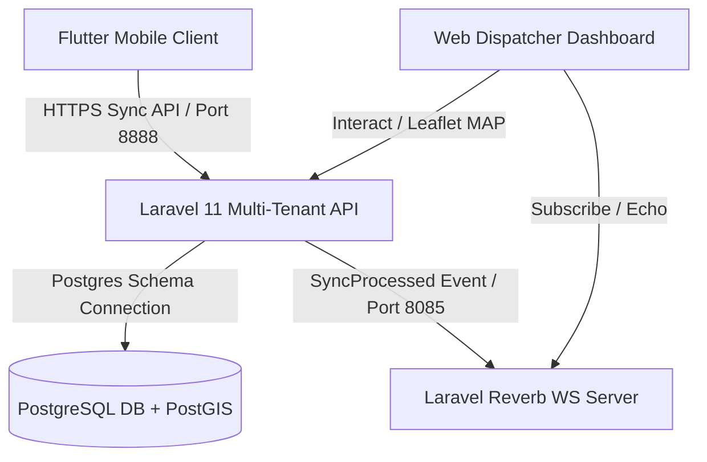

# OmniRoute: System Architecture & Technical Specifications

OmniRoute is a production-grade, multi-tenant Field Force Automation SaaS. It combines offline-first mobile tracking operations with a real-time dispatcher telemetry portal.

---

## 1. Architectural Blueprint

The system employs a decoupled, multi-tenant architecture designed to isolate client data securely while offering sub-second location updates from background mobile isolates.



---

## 2. Infrastructure Specifications

### Multi-Tenancy (Schema Isolation)
* We utilize `stancl/tenancy` with the **PostgreSQL Schema Isolation Driver**. 
* Each tenant (e.g., `acme`, `test`) resides in its own database schema namespace (e.g., `tenantacme`, `tenanttest`).
* **PostGIS Search Path Resolution:** Since spatial functions reside in the `public` schema, switching connection contexts hides the geography types. We handle this dynamically in [TenancyServiceProvider.php](file:///d:/Dev/omniroute-v2/app/Providers/TenancyServiceProvider.php) by executing:
  ```php
  DB::statement("SET search_path TO {$tenant->getTenantKey()}, public");
  DB::purge('tenant'); // Force connection boot with new search path
  ```

### Database & Spatial Engine
* **Engine:** PostgreSQL + PostGIS (`postgis/postgis:15-3.3`).
* **Spatial Columns:** All coordinates are stored utilizing the PostGIS Point type using the native 4326 Spatial Reference System (SRS).
* Central migrations reside in `database/migrations/` (tenants, domains, users). Tenant-specific migrations reside in `database/migrations/tenant/` (outlets, tracking logs, geofences).

### Real-Time Communications (WebSockets)
* **Server:** Laravel Reverb (running on port `8085` to avoid conflicts with existing processes on port `8080`).
* **Event Loop:** `SyncProcessed` and `GeofenceAlertTriggered` events are broadcasted over the tenant's private channels (`tenant.{tenant_id}.sync`).
* **Fault Tolerance:** Dispatch handshakes are wrapped in `try-catch` blocks inside services/jobs so that if the WebSocket socket server is offline, HTTP push synchronization requests still succeed and return `200 OK`.

---

## 3. Data Synchronization Engine (LWW)

Synchronization relies on a bidirectional Last-Write-Wins (LWW) replication engine.

```
       [ MOBILE Isar DB ]                          [ Laravel Server ]
               |                                           |
               |---- 1. pushUnsyncedLogs (Chunk: 50) ----->|
               |                                           | (LWW Version Check)
               |<--- 2. response 200 OK (Success Count) ---|
               | (Mark local logs as synced)               |
               |                                           |
               |---- 3. pullSync (Token + timestamp) ----->|
               |                                           | (Fetch updated definitions)
               |<--- 4. response 200 (Outlets/Logs) -------|
               | (Save local schemas)                      |
```

### Batch Chunking Constraint
To prevent payload timeouts on high-latency mobile networks, the mobile `SyncRepository` slices unsynced location logs into batches of **50 logs per HTTP request** during the push phase.

---

## 4. Mobile Client Specifications

* **Platform Framework:** Flutter SDK (`>=3.4.3 <4.0.0`).
* **Local Database:** Isar NoSQL (Fully reactive, bridge-free local database).
* **Background Execution:** `flutter_background_service` running in a dedicated Android foreground notification isolate to avoid OS termination under energy restrictions.
* **MinSdkVersion:** Configured to `23` (Android 6.0+) in [build.gradle](file:///d:/Dev/omniroute-v2/mobile/android/app/build.gradle#L46) to support secure cryptographic modules.
* **Session Persistence:** `flutter_secure_storage` to encrypt tokens, tenant domains, and worker profile metrics in the native Android Keystore and iOS Keychain.